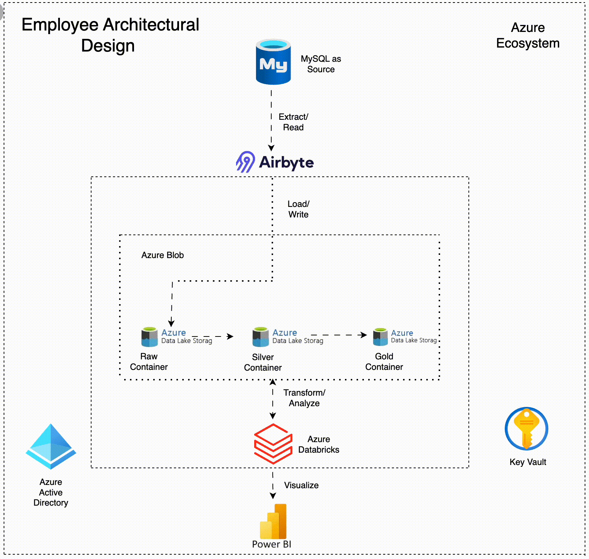
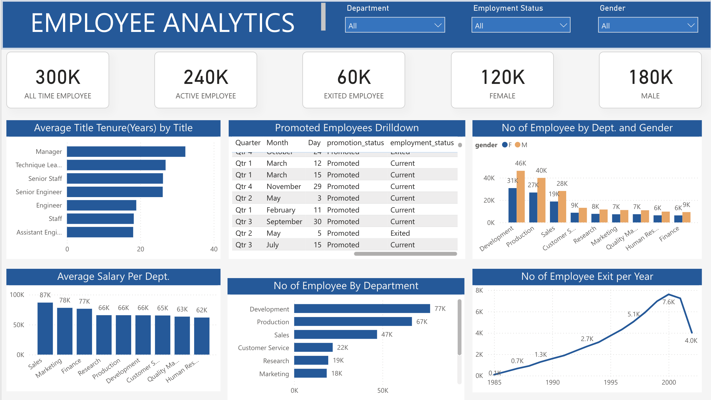

# Employee Data Analytics Project

## Background

TechNova Solutions, a leading technology consulting firm, approached us to help modernize their employee data management and analytics capabilities. With a growing workforce and increasing data complexity, they needed a robust system to handle employee data from ingestion to insightful visualizations. This project implements a modern data architecture using Azure ecosystem to process, analyze, and visualize employee data effectively.

## System Architecture

My solution implements a modern data pipeline using the following components:

1. **Source System**: MySQL database containing employee data
2. **Data Ingestion**: Airbyte for ETL operations
3. **Storage**: Azure Blob Storage for raw data
4. **Processing**: Databricks for data transformation and processing
5. **Data Layers**:
   - Raw Layer: Initial data dump from source
   - Silver Layer: Cleaned and standardized data
   - Gold Layer: Analytical tables for reporting
6. **Security**: Azure Key Vault for secrets management
7. **Authentication**: Azure Active Directory for Databricks access
8. **Visualization**: Power BI dashboard for insights

## Data Source

The employee data was sourced from the [test_db](https://github.com/datacharmer/test_db) repository, which contains a sample MySQL database with approximately 300,000 employee records and 2.8 million salary entries.

## Implementation Details

### Data Pipeline

1. **Ingestion**:
   - Airbyte extracts data from MySQL source
   - Implements SCD Type 1 using `updated_at` column
   - Loads raw data into Azure Blob Storage

2. **Transformation**:
   - Databricks mounts the raw blob container
   - Data cleaning and standardization in Silver Layer
   - Analytical table creation in Gold Layer

3. **Security**:
   - Azure Key Vault manages all sensitive credentials
   - Azure Active Directory handles authentication

4. **Visualization**:
   - Power BI connects to Gold Layer tables
   - Interactive dashboard for employee analytics

## Key Features

- **SCD Type 1 Implementation**: Handles slowly changing dimensions using `updated_at` timestamp
- **Data Quality Checks**: Ensures data integrity throughout the pipeline
- **Scalable Architecture**: Built on Azure ecosystem for enterprise-grade scalability
- **Secure Access**: Implements best practices for data security
- **Interactive Dashboard**: Provides actionable insights for HR and management

## Technical Specifications

| Component            | Technology Used         |
|-----------------------|-------------------------|
| Source Database       | MySQL                  |
| ETL Tool              | Airbyte                |
| Cloud Storage         | Azure Blob Storage     |
| Data Processing       | Databricks             |
| Data Layers           | Raw, Silver, Gold      |
| Security              | Azure Key Vault        |
| Authentication        | Azure Active Directory |
| Visualization         | Power BI               |

## Getting Started

### Prerequisites

- Azure account with necessary permissions
- Databricks workspace
- Power BI Pro license
- MySQL database credentials

### Installation

1. Set up Azure resources:
   - Create Blob Storage container
   - Configure Databricks workspace
   - Set up Key Vault and AAD integration

2. Configure Airbyte:
   - Set up MySQL source
   - Configure Azure Blob destination
   - Implement SCD Type 1 logic

3. Databricks setup:
   - Mount Blob Storage
   - Create notebooks for data processing
   - Implement data quality checks

4. Power BI:
   - Connect to Gold Layer tables
   - Create visualizations and reports

## Usage

1. **Data Ingestion**:
   - Run Airbyte sync to load raw data
   - Verify data in Blob Storage

2. **Data Processing**:
   - Execute Databricks notebooks for Silver and Gold layers
   - Monitor job execution

3. **Data Analysis**:
   - Access Power BI dashboard
   - Explore employee metrics and insights

## Employee Analytics Dashboard Analysis

 

This dashboard provides a comprehensive view of the organization's workforce metrics, covering headcount, employee status, gender distribution, tenure, promotions, salaries, and attrition trends.

## Key Metrics

### Headcount Summary
- **Total Employees:** 300,000
- **Active Employees:** 240,000
- **Exited Employees:** 60,000
- **Gender Distribution:** 120,000 females (40%) and 180,000 males (60%)

### Departmental Analysis

#### Distribution by Department and Gender
- **Development:** Largest department with 77K employees
  - Notable gender gap: 46K males vs 31K females
- **Production:** Second largest with 67K employees
  - Gender distribution: 40K males vs 27K females
- **Sales:** 47K employees with more balanced gender ratio
- **Customer Service:** 22K employees
- **Research:** 19K employees
- **Marketing:** 18K employees
- Smaller departments: Quality Management, Human Resources, Finance

#### Average Salary by Department
- **Sales:** Highest average salary at $87K
- **Marketing:** $78K
- **Finance:** $77K
- **Research:** $66K
- **Production:** $66K
- **Development:** $66K
- **Customer Service:** $65K
- **Quality Management:** $63K
- **Human Resources:** Lowest at $62K

### Career Progression

#### Average Title Tenure (Years)
- **Technique Lead:** Longest average tenure (~34 years)
- **Manager:** ~32 years
- **Senior Engineer:** ~30 years
- **Senior Staff:** ~28 years
- **Engineer:** ~22 years
- **Staff:** ~20 years
- **Assistant Engineer:** ~20 years

#### Promotion Patterns
- Most promotions occurred in Q1 (March, February)
- Consistent promotion activity throughout the year
- Only one record shows promotion followed by exit (Q2, May)
- Heaviest promotion months: March (27 total: 12+15), followed by November (29)

### Attrition Trends

#### Employee Exit per Year
- Notable upward trend from 1985 to 1999
- **1985:** Minimal exits (0.4K)
- **1990:** Modest increase (1.3K)
- **1995:** Significant increase (5.1K)
- **1999:** Peak year for exits (7.6K)
- **2000:** Sharp decline to 4.0K, suggesting possible improvement in retention strategies

## Insights and Recommendations

1. **Gender Diversity Issues:**
   - Significant gender imbalance across most departments
   - Technical departments (Development, Production) show the largest gender gaps
   - Consider targeted recruitment and retention strategies for female employees

2. **Departmental Salary Disparities:**
   - Sales commands premium compensation despite not being the largest department
   - Support functions (HR, Quality) have the lowest compensation
   - Review salary structures for competitiveness in critical departments

3. **Retention Concerns:**
   - The 20% exit rate (60K/300K) warrants investigation
   - The dramatic rise in exits through the 1990s followed by a sudden drop suggests organizational changes
   - Further analysis needed to understand the causes behind the peak and subsequent drop

4. **Career Development:**
   - Very long tenure across management positions suggests possible career stagnation
   - The organization appears to have a traditional career ladder with clear progression paths
   - Consider whether long tenure periods are optimal for innovation and growth

5. **Promotion Practices:**
   - Quarterly promotion patterns suggest a structured review system
   - Low exit rate among promoted employees indicates effective talent management
   - Consider whether promotion concentration in Q1 is optimal or creates bottlenecks

## Maintenance

- Monitor pipeline health
- Regularly update security credentials
- Perform data quality checks
- Optimize Databricks jobs for performance

## Acknowledgments

- [test_db](https://github.com/datacharmer/test_db) for the sample employee data
- Azure documentation and support
- Airbyte community for ETL best practices

